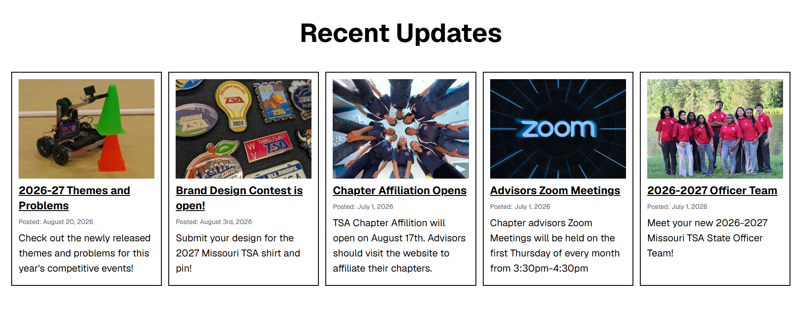
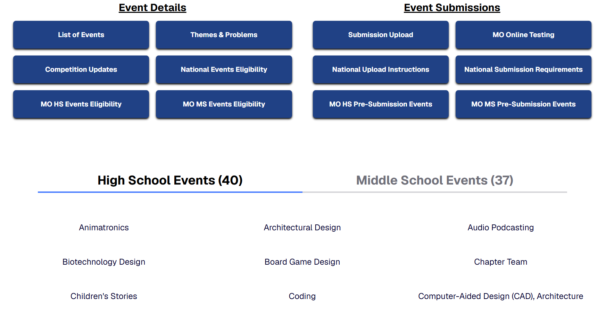
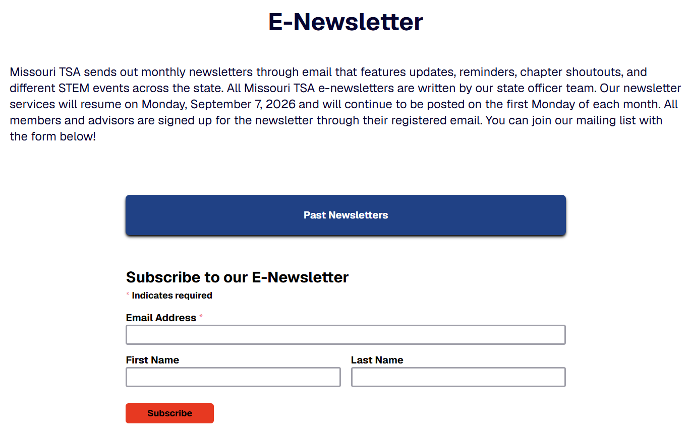
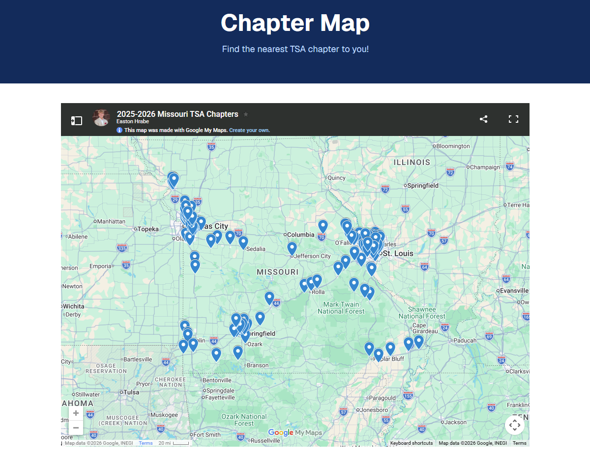

# MOTSA Website
New website for Missouri Technology Student Association made by the 2026-2027 state officer team.

Website link: https://motsaweb.org

## Purpose and Use
This new Missouri TSA website is a hub of all updated and reliable information that any member and advisor might need. The website is maintained by the officer team and is updated at least once every month. 

### Important features:
Every page on this website was placed with the purpose of allowing members to find valuable information the quickest and easiest. Below are some features the officer team thinks members should make of use the most.

1. The "Recent Updates" section on the home page features the most relevant announcements from both Missouri and National TSA. Clicking on each update box will take you to another page with further information.

2. The "Competitive Events" page links all important resources you need for the State Championship Conference and the National Conference. Clicking on each event also allows you to see more in-depth information of what each event is and its requirements.

3. The "E-Newsletter" page links a catalog of all past newsletters and it allows you to get subscribed to our monthly E-Newsletter service. This is the most convinient way to get updated information throughout the year.

4. The "Chapter Map" page features an interactive map of all affiliated TSA chapters within Missouri. We are working to update accurate locations and contact information.

## Why It Was Made
One of the biggest issue the 2026-27 state officer team wanted to address was the inefficiency and unreliability of the Missouri TSA website. It would often contain outdated information and was not easy to navigate. For years, members and advisors struggled to find reliable information on the conferences, competitive events, various applications, and dates & deadlines. This year's team decided it would be most beneficial to completely redesign the website from scratch. This new website is aimed to be a hub of all information members and advisors need, made easily to find.

### The Team
This website was originally made by the 2026-27 state officer team, led by state treasurer Thuc Chi "Tracy" Do ([thucchi-cs](https://github.com/thucchi-cs)). State president Axum Yared ([axumaityared](https://github.com/axumaityared)) and state sergeant-at-arms Jason Kogbara ([lesaucissonjason](https://github.com/lesaucissonjason)) also contributed to the code and design.

### How It Was Made
This website was created using `NextJS`. We originally used an external Neon Postgresql database, but found it to be inefficient and unecessary. All data are then moved to be stored in `json` files in the "data" directory. The website is hosted on `Vercel`.