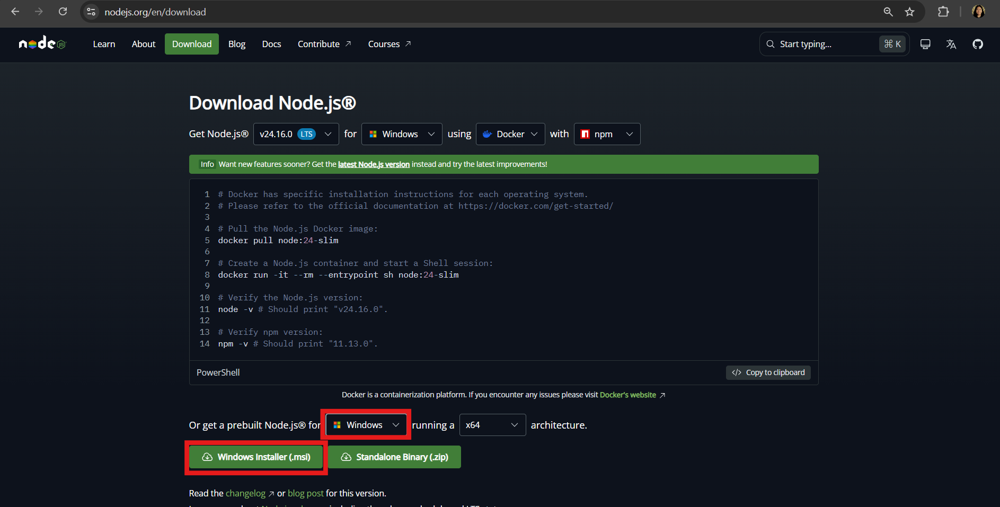
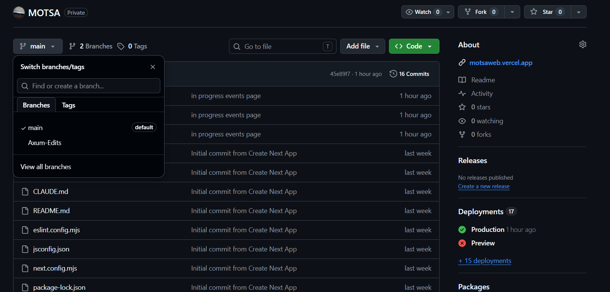
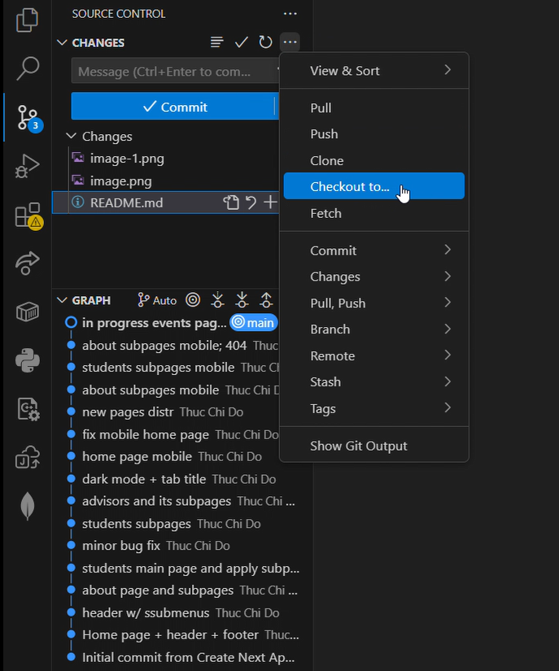

# MOTSA Website
New website for Missouri Technology Student Association made by the 2026-2027 state officer team.

Preview link: https://motsaweb.vercel.app


# Contributors - Getting Started
** All links below are documentation to help you code **

Made with [Next.js](https://nextjs.org), a web framework based on [React Native](https://reactnative.dev/), using [app router](https://nextjs.org/docs/app/getting-started/layouts-and-pages), [Tailwind CSS](https://tailwindcss.com/), and JavaScript.

## Installations
If you don't already have VSCode, [download](https://code.visualstudio.com/download) it or another similar code editor.

Ensure your have [Git downloaded](https://git-scm.com/install/).

[Download prebuilt Node.js](https://nodejs.org/en/download) based on your operating system as shown in the image below.


## Your own branch

### What is a Branch?
A branch is a separate workspace where you can make changes to a project without affecting the main/official version of the code. It allows developers to safely test new features, experiment with ideas, and fix bugs. When the changes are complete and working correctly, your branch can be merged into the "main" branch so the updates become part of the main/official codebase. 

### Creating Your Own Branch
On this Github Repository page, first, make sure you are on the "main" branch. Click on the branch dropdown and type in the name of your new branch (use your name or name-Edits). Then click "Create branch." 


## VSCode
### Opening the Repository (only once when getting started)
Open up VSCode and open a folder you would like this project to reside in. Then in the terminal, type in

`git clone https://github.com/thucchi-cs/MOTSA` 

Provide your GitHub username and password if needed. You will then see a newly created folder named "MOTSA". 

Click file>Open Folder... and select this new MOTSA folder. You are now in the project repository on VSCode.

### Go to Your Branch
When in the MOTSA folder, select the Source Control tab on the left-hand side. Click the three dots on the Changes section and select Checkout to... . Then click on your new branch name. You are now in your own branch workspace. All edits made here will not affect the main codebase.


### Commit Your Changes (With GUI)
After your changes have been tested and are ready to be included in the project:
* Go to the Source Control tab on the left-hand side
* In the text box, write a short and quick summary of your changes (ex: "resize header bar; add images for officers")
* Press the blue Commit button
* Once it has been commited, the button will change to "Sync Changes". Right now, the new changes you have commited are only present on your device, press the "Sync Changes" button to update your branch online

Congrats! You have successfully committed and pushed your changes!

### Commit Your Changes (With the Terminal)
After your changes have been tested and are ready to be included in the project
* Go to the terminal in VSCode
* Type in `git add .` (Do not forget the period "." at the end). This will prepare all your changed files to commit
* Type `git commit -m "Your commit message"`. Replace "Your commit message" with a short and quick summary of your changes (ex: "resize header bar; add images for officers"), make sure to still keep the quotation marks
* After you have commited, the new changes you have commited are only present on your device and you will need to update your branch online by typing `git push`

Congrats! You have successfully committed and pushed your changes!

## Next JS Quick Guide

### Testing Locally
When you are in the MOTSA repository folder in VSCode, open up the terminal and type in 

`npm run dev`

Open http://localhost:3000 with your browser to see the current version of the website. Any changes you make to the code will update live on this site.

### JSX
Next JS uses JSX which is a way to embed HTML into JavaScript. Here are guides on how to write JSX:

Basics on JSX: https://react.dev/learn/writing-markup-with-jsx

JS inside JSX: https://react.dev/learn/javascript-in-jsx-with-curly-braces

Conditional Rendering: https://react.dev/learn/conditional-rendering

Rendering Lists: https://react.dev/learn/rendering-lists

### File Structure
This project uses the app router instead of pages router. 
```
MOTSA/
├── app/
│    ├── [subpage]/
│    │   └── page.js
│    └── page.js
├── components/
└── public/
```
**app/:**

In the directory `app/` is where all of the main code goes. Each `page.js` file is code for a page on the website. In `app/page.js` is the home page. Every folder in `app/` is a subdirectory of the website. For example, `app/about/` will be the `motsaweb.org/about` page, and `app/about/page.js` is the code for that page. Similarly, `app/about/history/` is the `motsaweb.org/about/history` page, and `app/about/history/page.js` is the code.

**components/:**

Components are reusable blocks of code throughout the website. For example, the Header is a component because it is used in every single page of the website. So instead of copy/pasting that same piece of code on every page, the code for the Header is in `components/Header.js`, and each page references that code. 

Basics about components: https://react.dev/learn/your-first-component

Components with props: https://react.dev/learn/passing-props-to-a-component

**public/:**

The `public/` directory contains all images and assets of the project. Once the asset is in `public`, it can be referenced in the code as `/[image.png]`

## Learn More

To learn more about Next.js, take a look at the following resources:

- [Next.js Documentation](https://nextjs.org/docs) - learn about Next.js features and API.
- [Learn Next.js](https://nextjs.org/learn) - an interactive Next.js tutorial.